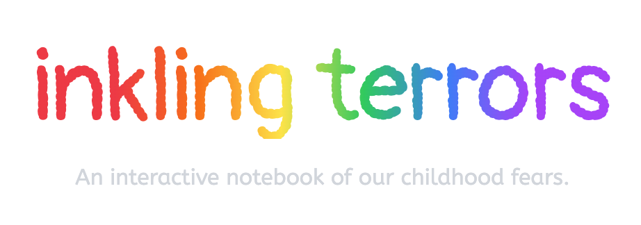

<!-- PROJECT LOGO -->
 

  

  

    A real-time online notebook.
  

  
  

     
    <a href="https://inkling-terrors.web.app"><strong>Try the live demo »</strong></a>
     
  

<!-- ABOUT THE PROJECT -->
## About The Project

A simply designed web page that allows users to make drawings that are automatically uploaded to the website under the notebook section. Created as part of a final project for a digital humanities class, I also wrote about some of my online research into child psychology. 

### Built With

For this project I wanted to really get into learning some frameworks I hadnt touched before. I have heard quite a bit about NextJS and was interested in what you can do with it. I definitely want to take another crack at it now that I have learned a bit more! Maybe the code will be a little cleaner next time. I also learned firebase for this project, it might be a little heavy weight for this kind of project but I really enjoyed learning how to use it. For future personal projects I would like to learn pocketbase or supabase. Of course, as per the usual I also used tailwind to speed up the design side of things.

* Tailwind
* NextJS
* Firebase 🔥 

<!-- CONTACT -->
## Contact

If you would like to contact me about this project feel free to reach out:

Jack Lindsey-Noble - jacknoble0303@gmail.com - 203-349-0236
